<div align="center">


<br/>

<p align="center">
  <strong>An AI travel agent that understands you in Hindi, Hinglish, or English —<br/>
  searches real flights, trains & hotels, builds a budget-optimised itinerary,<br/>
  and books everything in one conversation.</strong>
</p>

<br/>

<p align="center">
  
  
  
  
  
  
  
  
  
  
  
  
</p>

<br/>

<p align="center">
  <a href="#-architecture">Architecture</a> ·
  <a href="#-features">Features</a> ·
  <a href="#-free-api-stack">API Stack</a> ·
  <a href="#-database-schema">Database</a> ·
  <a href="#-getting-started">Getting Started</a> ·
  <a href="#-build-order">Build Order</a>
</p>

</div>

---

## 🧭 What Is This?

**Plan Through Us** (powered by **Nura AI**) is not a search engine. Not a chatbot. It is a **production-grade, voice-first AI travel co-pilot** — a swarm of specialised agents that collaborates in real time to plan, optimise, and book an end-to-end trip for Indian travelers, in their language.

> **"मुझे अक्टूबर में पाँच दिन केरल जाना है ₹30,000 में"**
> → Real day-by-day itinerary, train + hotel + activities, spoken back in Hindi. ✅

**Three non-negotiable principles:**

| Principle | What it means |
|---|---|
| **One shared wallet** | Live APIs → specialist agents → planner → user chooses → only then booking. No hidden category locks. |
| **Durable state** | Live trip session is temporary working state. Users, trips, bookings, history live in Supabase — never lost. |
| **Six clean responsibilities** | Each agent has exactly one job. They never cross into each other's domain. |

---

## 🏗️ Architecture

### System Overview

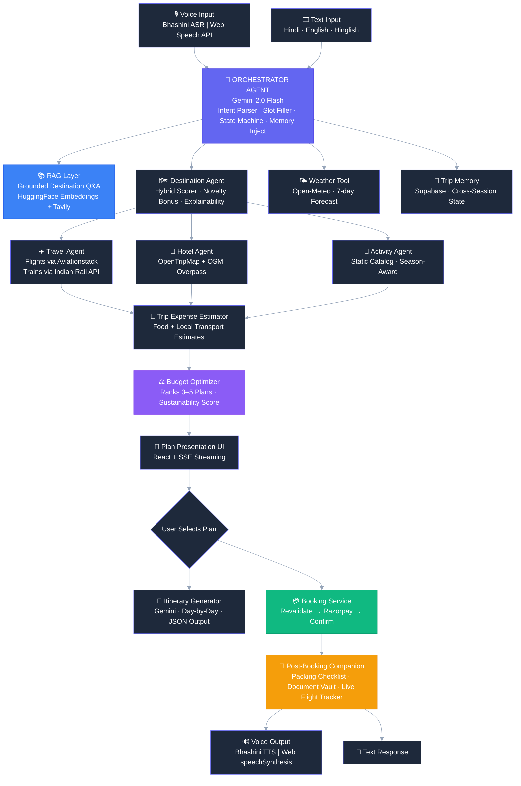

---

### Agent Responsibility Matrix

```mermaid
%%{init: {'theme': 'base', 'themeVariables': {'primaryColor': '#1E293B', 'primaryTextColor': '#F1F5F9', 'lineColor': '#475569', 'background': '#0F172A'}}}%%
graph LR
    subgraph ORCHESTRATOR ["🧠 Orchestrator — Talk · Route · State"]
        O1["Intent Parsing\n(JSON mode)"]
        O2["Slot Filling\n(Hinglish-native)"]
        O3["State Machine\nplanning→review→booking→booked"]
        O4["Memory Injection\n< 500 tokens"]
    end

    subgraph SPECIALISTS ["⚡ Parallel Specialist Agents"]
        S1["✈️ Travel Agent\nFlights + Trains"]
        S2["🏨 Hotel Agent\nOpenTripMap + OSM"]
        S3["🧗 Activity Agent\n~120 catalog entries"]
    end

    subgraph SYNTHESIS ["🔗 Synthesis Layer"]
        Y1["💸 Expense Estimator\nFood + Local Transport"]
        Y2["⚖️ Budget Optimizer\n1 shared wallet"]
    end

    ORCHESTRATOR --> SPECIALISTS
    SPECIALISTS --> SYNTHESIS

    style ORCHESTRATOR fill:#6366F1,color:#fff
    style SPECIALISTS fill:#8B5CF6,color:#fff
    style SYNTHESIS fill:#10B981,color:#fff
```

---

### State Machine

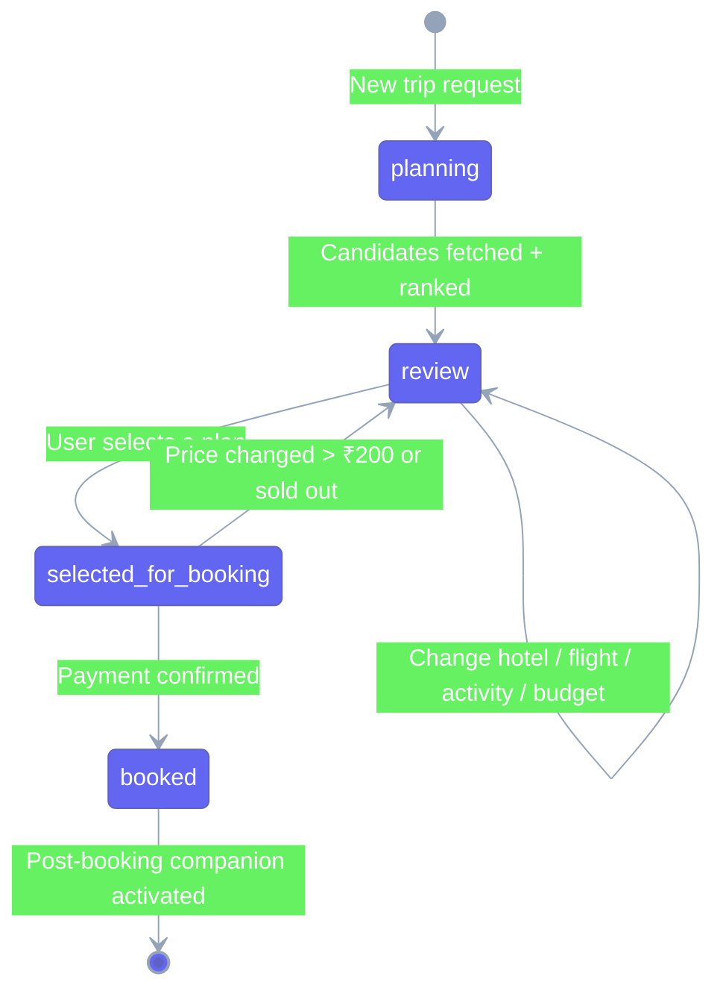

---

### Replan Logic (Incremental — Never Full Recompute)

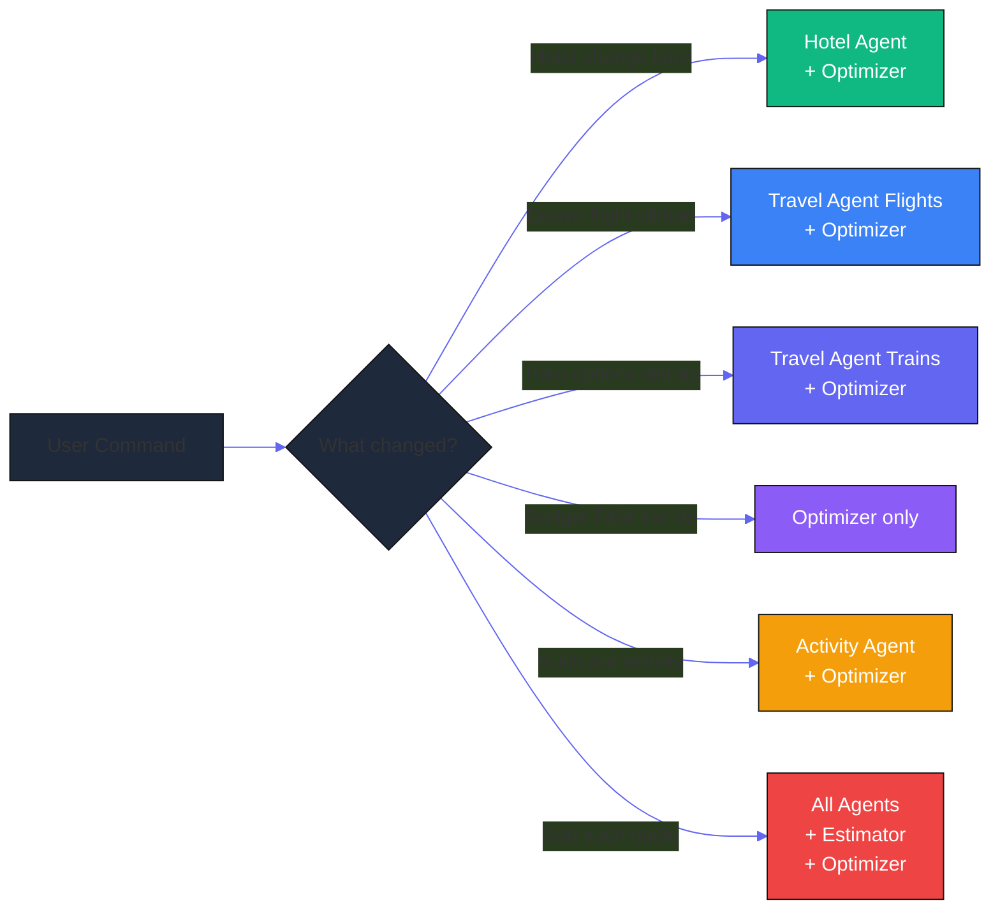

---

## ✨ Features

### Feature 1 — 🎙️ Voice-First Input & Output

Bhashini ASR converts spoken Hindi, Hinglish, Tamil, Telugu, Bengali, Marathi, or English into text. The agent replies via Bhashini TTS in the same language. Web Speech API is the silent fallback.

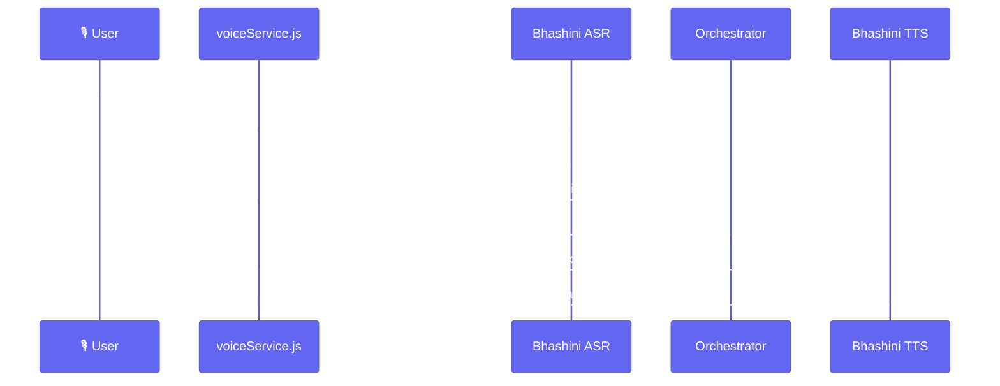

**Error handling:** Mic denied → friendly prompt. No speech → "Kuch suna nahi — dobara bolein?". Bhashini unreachable → silent fallback to Web Speech. All voice logic isolated in `src/services/voiceService.js`.

---

### Feature 2 — 💬 Multilingual Hinglish NLU

Gemini 2.0 Flash parses free-form, code-mixed queries into structured JSON intents. "Hotel change karo, budget thoda zyada kar" → `{ intent: "CHANGE_HOTEL", budget_delta: "increase" }`.

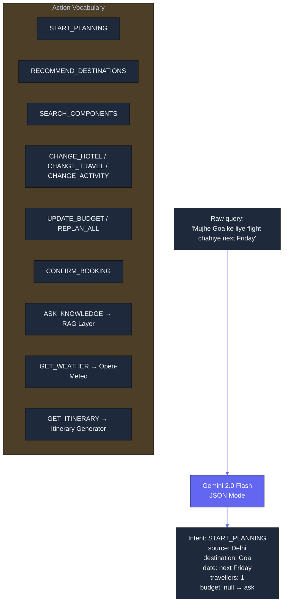

---

### Feature 3 — 📚 RAG Knowledge Layer

Grounds destination Q&A in a real corpus — not hallucination. ~65 chunks (month-by-month suitability, entry fees, packing, etiquette, pitfalls) embedded with `paraphrase-multilingual-MiniLM-L12-v2`. Cosine search returns top-3 chunks injected into the Gemini prompt.

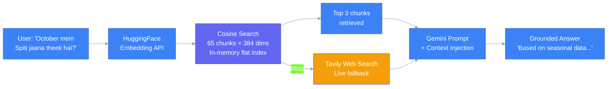

---

### Feature 4 — 🗺️ Destination Recommendation Agent

Hybrid scorer across ~65 destinations with a **novelty bonus** — at least 20% of every slate is a lesser-known destination (Ziro Valley, Mawlynnong, Chand Baori, Tawang).

```
score(destination) =
  0.4 × interest_match
+ 0.3 × season_fit
+ 0.2 × budget_fit
+ 0.1 × novelty_bonus
```

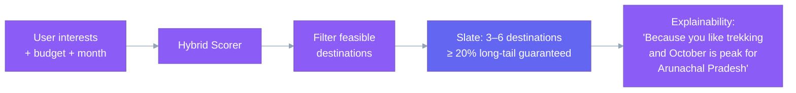

No live API call at this stage — runs entirely on static metadata in the backend.

---

### Feature 5 — ✈️🚂 Travel Agent (Flights + Trains, Parallel)

Searches flights and trains as genuine alternatives under the same budget.

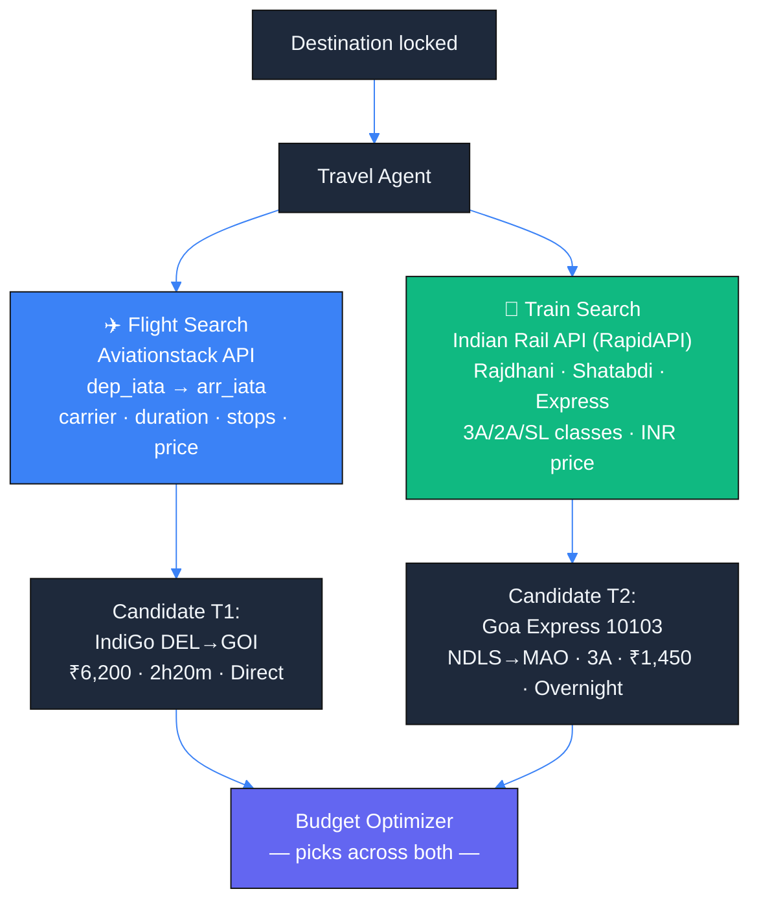

Each candidate carries `source_reference` + `expires_at` — stale candidates are excluded at booking time.

---

### Feature 6 — 🏨 Hotel Agent

Returns 5 candidates across budget tiers for any supported destination.

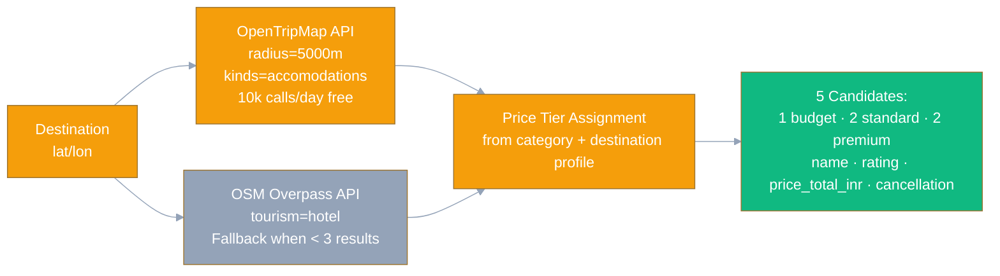

---

### Feature 7 — 🧗 Activity Agent (Season-Aware)

Static catalog of ~120 curated Indian experiences. Filtered by region, month, difficulty, price, and user interests.

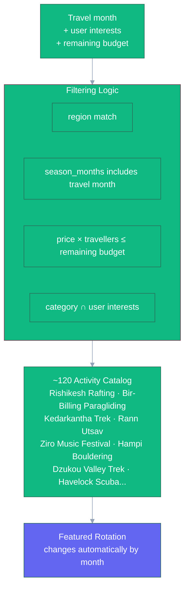

---

### Feature 8 — 💸 Trip Expense Estimator

Estimates food + local transport per destination, clearly labeled as estimates — never guaranteed costs.

| Destination | Food/day | Local Transport/day | Profile |
|---|---|---|---|
| Goa | ₹800 | ₹400 | standard |
| Ladakh | ₹600 | ₹600 | standard |
| Kerala | ₹500 | ₹300 | standard |
| Rajasthan | ₹400 | ₹250 | budget |
| Spiti | ₹450 | ₹500 | budget |
| Andaman | ₹700 | ₹350 | standard |

Output always shows `~₹7,000 estimated for food (standard profile) — not charged by us`.

---

### Feature 9 — ⚖️ Budget Optimizer

Combines all candidates under one total budget. Ranks 3–5 feasible combinations with distinct plan labels. Two soft scoring signals added:

- **Sustainability score (0–1):** Low-footfall + low-fragility destinations score higher.
- **Crowd score (0–1):** Off-peak month preference.

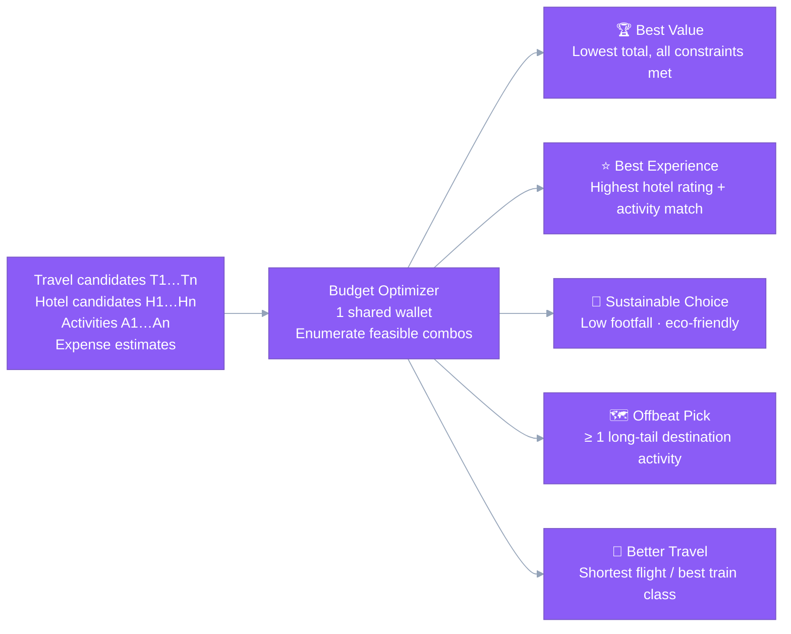

---

### Feature 10 — 📅 Day-by-Day Itinerary Generator

After plan selection, Gemini generates a real time-slotted itinerary — not just "Plan B: T2 + H3 + A3".

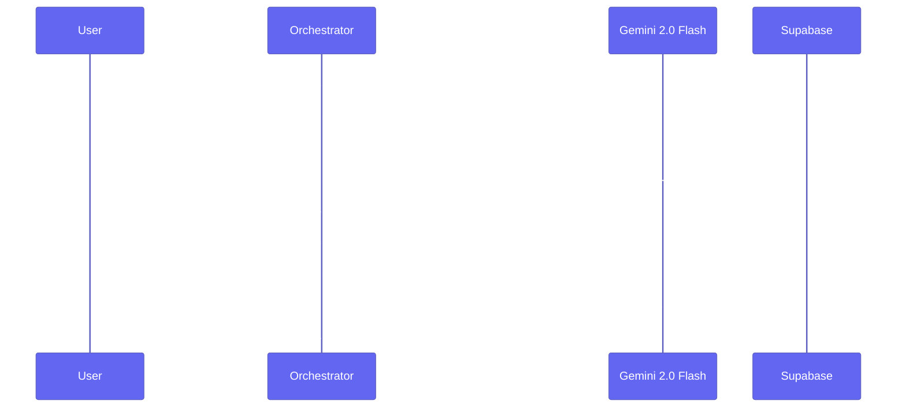

Each day slot: `time · type (travel/checkin/explore/food) · description · estimated_spend_today_inr`.

---

### Feature 11 — 🌤️ Weather Tool

Real-time 7-day forecasts via Open-Meteo (free, no API key). Used both for direct user queries and passively by the Destination Agent to validate static season tags.

```
GET https://api.open-meteo.com/v1/forecast
  ?latitude=10.05&longitude=77.06
  &daily=precipitation_sum,temperature_2m_max,temperature_2m_min
  &timezone=Asia/Kolkata&forecast_days=7
```

Gemini summarises the raw data into plain language:
> *"Munnar ke liye agle hafte mein halki baarish ki sambhavana hai — raincoat saath rakhein."*

---

### Feature 12 — 💾 Trip Memory (Cross-Session)

On every new session, the Orchestrator injects the last 3 trip summaries + preference profile as a system prompt prefix (< 500 tokens). In-progress trips resume without re-explaining.

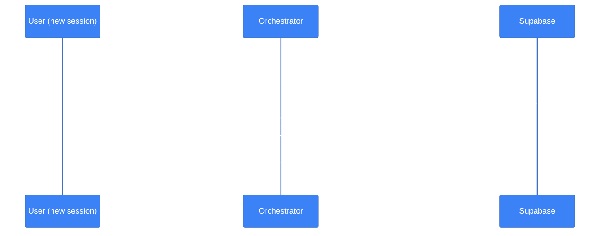

---

### Feature 13 — 💳 Booking Service

Revalidates price and availability before any payment. Shows changes > ₹200 to the user for re-confirmation.

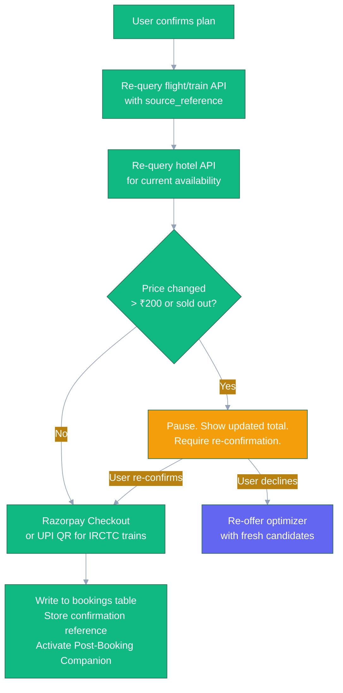

---

### Feature 14 — 🔄 Replan Logic

Surgical reruns — never full recompute on a partial change.

| User says | What reruns |
|---|---|
| "Hotel change karo" | Hotel Agent → Optimizer |
| "Doosri flight dikhao" | Travel Agent (flights only) → Optimizer |
| "Train options dikhao" | Travel Agent (trains only) → Optimizer |
| "Budget ₹45k kar do" | Optimizer only |
| "Kuch aur activity add karo" | Activity Agent → Optimizer |
| "Sab kuch badlo" | All Agents → Estimator → Optimizer |

Old candidates are marked `superseded_at` — never deleted. Full history preserved.

---

### Feature 15 — 🎒 Post-Booking Companion

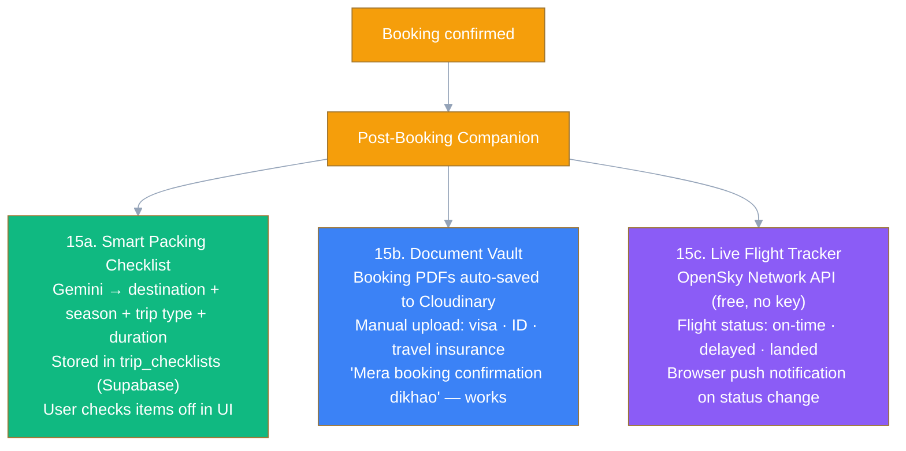

---

## 🆓 Free API Stack

All APIs are confirmed free-tier. No paid contracts.

| Need | Service | Free Tier | Notes |
|---|---|---|---|
| LLM / Agents | **Google Gemini 2.0 Flash** | Generous free tier | All agent reasoning |
| LLM fallback | **Groq (Llama 3.x)** | Free, very fast | Cheap tool-calling loops |
| Flight search | **Aviationstack** | 500 calls/mo | Routes, schedules, carriers |
| Flight fallback | **OpenSky Network** | Free, no key | Live aircraft + route confirmation |
| Trains | **Indian Rail API (RapidAPI)** | Free tier | PNR, trains between stations |
| Hotels | **OpenTripMap** | 10k calls/day free | POI + stay data |
| Hotels fallback | **OSM Overpass API** | Free, no key | Accommodation POIs |
| Maps / routing | **OSM + OSRM + Nominatim** | Free, no key | Already integrated |
| Geocoding | **Photon** | Free, no key | Already integrated |
| Weather | **Open-Meteo** | Free, no key | 7-day forecast |
| Voice STT | **Bhashini ASR** | Free (Govt. of India) | 22 Indian languages |
| Voice STT fallback | **Web Speech API** | Free, in-browser | Zero-dependency fallback |
| Voice TTS | **Bhashini TTS** | Free | Same service |
| Voice TTS fallback | **Web speechSynthesis** | Free, in-browser | Browser-native |
| Embeddings | **HuggingFace Inference API** | Free tier | Multilingual sentence-transformers |
| Web search | **Tavily** | 1,000 calls/mo free | RAG fallback for live data |
| Media | **Cloudinary** | Free tier | Document vault PDFs |
| Database | **Supabase** | Free tier | PostgreSQL + Realtime + Storage |
| Auth | **Clerk** | Free tier | User sessions |
| Frontend | **Vercel** | Free tier | Auto-deploy from GitHub |
| Backend | **Render** | Free tier | FastAPI agent backend |

---

## 🗄️ Database Schema

```sql
-- Users (Clerk ID as primary key)
CREATE TABLE users (
  id text PRIMARY KEY,
  preference_profile jsonb,
  created_at timestamptz DEFAULT now()
);

-- Core trip record
CREATE TABLE trips (
  id uuid DEFAULT gen_random_uuid() PRIMARY KEY,
  user_id text REFERENCES users(id),
  source text, destination text,
  travel_date date, days int, travellers int,
  total_budget_inr int,
  status text DEFAULT 'planning', -- planning|review|selected_for_booking|booked
  created_at timestamptz DEFAULT now(),
  updated_at timestamptz DEFAULT now()
);

-- Extracted trip requirements from conversation
CREATE TABLE trip_requirements (
  trip_id uuid REFERENCES trips(id),
  interests text[],
  constraints jsonb,
  spending_style text, -- budget|standard|premium
  raw_conversation_summary text
);

-- All curated candidates (flights, trains, hotels, activities)
CREATE TABLE trip_candidates (
  id text PRIMARY KEY, -- T1, T2, H1, A1 etc.
  trip_id uuid REFERENCES trips(id),
  type text, -- FLIGHT|TRAIN|HOTEL|ACTIVITY
  provider text,
  provider_reference text,
  data_json jsonb,
  price_inr int,
  expires_at timestamptz,
  superseded_at timestamptz -- set on replan, never deleted
);

-- Non-bookable expense estimates
CREATE TABLE trip_cost_estimates (
  trip_id uuid REFERENCES trips(id),
  food_estimate_inr int,
  local_transport_estimate_inr int,
  estimation_method text,
  profile_level text,
  confidence text
);

-- Ranked optimizer output
CREATE TABLE trip_plans (
  id uuid DEFAULT gen_random_uuid() PRIMARY KEY,
  trip_id uuid REFERENCES trips(id),
  travel_candidate_id text,
  hotel_candidate_id text,
  activity_candidate_ids text[],
  estimated_total_inr int,
  label text, -- Best Value|Best Experience|Sustainable Choice|Offbeat Pick|Better Travel
  sustainability_score float,
  created_at timestamptz DEFAULT now()
);

-- User's plan selection
CREATE TABLE selected_plans (
  trip_id uuid REFERENCES trips(id),
  plan_id uuid REFERENCES trip_plans(id),
  selected_at timestamptz DEFAULT now()
);

-- Post-payment bookings
CREATE TABLE bookings (
  id uuid DEFAULT gen_random_uuid() PRIMARY KEY,
  trip_id uuid REFERENCES trips(id),
  component_type text,
  provider text,
  provider_reference text,
  final_price_inr int,
  status text,
  confirmation_reference text,
  document_url text -- Cloudinary URL
);

-- Cross-session trip memory
CREATE TABLE user_trip_memory (
  id uuid DEFAULT gen_random_uuid() PRIMARY KEY,
  user_id text REFERENCES users(id),
  trip_summary jsonb,
  preference_profile jsonb,
  updated_at timestamptz DEFAULT now()
);

-- Post-booking packing checklists
CREATE TABLE trip_checklists (
  trip_id uuid REFERENCES trips(id),
  items jsonb, -- [{item, category, checked}]
  generated_at timestamptz DEFAULT now()
);
```

---

## 🚀 Getting Started

### Prerequisites

- Node.js v18+
- Python 3.10+
- A Supabase project
- A Clerk account
- API keys: Google Gemini, Aviationstack, OpenTripMap, HuggingFace, Tavily, Cloudinary, Bhashini

### Installation

```bash
# 1. Clone
git clone https://github.com/divyanshux-tech/agent-repo.git
cd agent-repo

# 2. Backend
cd backend
python -m venv .venv
source .venv/bin/activate       # Windows: .venv\Scripts\activate
pip install -r requirements.txt
cp .env.example .env
# → Fill in your API keys
uvicorn main:app --reload --port 8000

# 3. Frontend (new terminal)
cd frontend
npm install
npm run dev
```

### Environment Variables (Backend `.env`)

```env
GEMINI_API_KEY=
GROQ_API_KEY=
AVIATIONSTACK_API_KEY=
OPENTRIPMAP_API_KEY=
RAPIDAPI_KEY=               # Indian Rail API
HUGGINGFACE_API_KEY=
TAVILY_API_KEY=
CLOUDINARY_URL=
BHASHINI_API_KEY=
SUPABASE_URL=
SUPABASE_SERVICE_KEY=
CLERK_SECRET_KEY=
RAZORPAY_KEY_ID=
RAZORPAY_KEY_SECRET=
```

> ⚠️ **Security:** All third-party API calls are proxied through the Render backend. No API key is ever exposed in the client bundle.

---

## 📂 Repository Structure

```
agent-repo/
├── backend/
│   ├── main.py                    # FastAPI entry point, SSE streaming
│   ├── agents/
│   │   ├── orchestrator.py        # Intent parsing, state machine, memory inject
│   │   ├── destination_agent.py   # Hybrid scorer, novelty bonus
│   │   ├── travel_agent.py        # Flights (Aviationstack) + Trains (Indian Rail)
│   │   ├── hotel_agent.py         # OpenTripMap + OSM Overpass
│   │   ├── activity_agent.py      # Static catalog, season filter
│   │   ├── expense_estimator.py   # Food + local transport profiles
│   │   ├── budget_optimizer.py    # Enumeration, sustainability scoring
│   │   ├── itinerary_generator.py # Day-by-day via Gemini
│   │   └── booking_service.py     # Revalidate → Razorpay → confirm
│   ├── services/
│   │   ├── rag_service.py         # HuggingFace embeddings, cosine search, Tavily fallback
│   │   ├── weather_service.py     # Open-Meteo integration
│   │   ├── memory_service.py      # Supabase trip memory read/write
│   │   └── companion_service.py   # Checklist, document vault, flight tracker
│   ├── data/
│   │   ├── destinations.json      # ~65 destination metadata entries
│   │   ├── activities.json        # ~120 activity catalog entries
│   │   └── cost_profiles.json     # Food + transport estimates per destination
│   └── requirements.txt
│
├── frontend/
│   ├── src/
│   │   ├── services/
│   │   │   └── voiceService.js    # listen() · speak() · detectLanguage() · cancel()
│   │   ├── hooks/
│   │   │   └── useSSE.js          # Real-time SSE streaming from backend
│   │   ├── components/
│   │   │   ├── ChatComposer.jsx   # Mic button, waveform, text input
│   │   │   ├── FlightCard.jsx     # Interactive flight candidate card
│   │   │   ├── TrainCard.jsx      # Interactive train candidate card
│   │   │   ├── HotelCard.jsx      # Interactive hotel candidate card
│   │   │   ├── ActivityCard.jsx   # Activity candidate card
│   │   │   ├── PlanCard.jsx       # Ranked plan card (Best Value, etc.)
│   │   │   ├── ItineraryTimeline.jsx  # Day-by-day trip view
│   │   │   ├── PackingChecklist.jsx   # Post-booking checklist
│   │   │   ├── DocumentVault.jsx      # PDF upload + Cloudinary display
│   │   │   └── FlightTracker.jsx      # Live OpenSky status
│   │   └── App.jsx
│   └── package.json
│
└── scripts/
    ├── seed_destinations.py       # Populate destination metadata
    ├── seed_activities.py         # Populate activity catalog
    └── embed_knowledge_base.py    # Embed RAG corpus → vectors JSON
```

---

## 🏗️ Build Order

Build strictly in this sequence — each phase is testable before the next begins:

| Phase | What to build | Test signal |
|---|---|---|
| 1 | Supabase schema + Render FastAPI skeleton | Schema migrations applied, `/health` live |
| 2 | Orchestrator + Hinglish NLU (text only) | 10 test queries parse correctly |
| 3 | Destination metadata + scoring function | Shortlist in < 200ms, explains each pick |
| 4 | Travel Agent — trains (Indian Rail API) | Train candidates for Delhi→Goa |
| 5 | Travel Agent — flights (Aviationstack) | Flight candidates for same route |
| 6 | Hotel Agent (OpenTripMap + OSM) | 5 candidates across 2 price tiers |
| 7 | Activity Agent (static catalog) | Season-filtered activities for October Kerala |
| 8 | Expense Estimator | Cost profiles for 10 destinations |
| 9 | Budget Optimizer | 3 ranked plans for a test trip |
| 10 | RAG knowledge layer | "Is October good for Spiti?" answered correctly |
| 11 | Itinerary Generator | Day-by-day plan from selected plan in < 10s |
| 12 | Weather Tool | Hindi weather summary for any Indian city |
| 13 | Voice input (Bhashini ASR + Web Speech fallback) | Hindi query processed end-to-end |
| 14 | Voice output (Bhashini TTS) | Reply spoken back in user's language |
| 15 | Trip Memory (Supabase) | Second session resumes without re-explaining |
| 16 | Booking Service (Razorpay + revalidation) | Test booking completes with confirmation |
| 17 | Post-booking companion (checklist + tracker) | Checklist generated, flight status shown |
| 18 | Replan logic | "Change hotel" does not re-call flight API |
| 19 | Polish, error states, demo rehearsal | All acceptance criteria pass |

---

## 🌍 Real Problems This Solves

| Problem | How Nura fixes it |
|---|---|
| **Language barrier in digital travel** | Most platforms are English-only. Nura works in Hindi, Hinglish, Tamil, Telugu, Bengali, Marathi — entirely by voice. |
| **Price opacity + hidden costs** | Shared-wallet model with transparent "booked vs estimated" breakdown. No ₹5k flight becoming a ₹40k trip surprise. |
| **Overtourism at popular sites** | ≥20% of every recommendation slate is a lesser-known destination. Sustainable Choice plan actively routes demand away from Goa/Jaipur. |
| **Train vs flight blind spot** | Indian trains carry 8 billion passengers/year. No major travel AI treats them as genuine alternatives. Nura does. |
| **Cold-start uselessness** | Content + seasonality scorer makes useful first recommendations without any prior user data. |
| **Post-booking abandonment** | Packing checklist, document vault, and live flight tracker extend the agent's value through the trip itself. |

---

## ✅ Full Acceptance Criteria

- [ ] `"मुझे अक्टूबर में पाँच दिन केरल जाना है ₹30,000 में"` → real day-by-day itinerary, train + hotel + activities, spoken back in Hindi
- [ ] `"Goa trip plan karo, 4 din, 2 log, 25k budget"` parses correctly → 3 ranked plans
- [ ] Train options shown for Delhi–Goa, Delhi–Jaipur, Mumbai–Goa
- [ ] Weather query answered in plain Hindi with packing advice (jacket / umbrella / sunscreen)
- [ ] "Hotel change karo" does not re-call the flight API
- [ ] ≥ 1 of every 5 destination recommendations is a lesser-known destination
- [ ] Every recommendation includes a plain-language explanation
- [ ] Voice input works in Chrome via Bhashini; falls back to Web Speech elsewhere
- [ ] Bhashini unreachable → silent fallback, no error shown to user
- [ ] Booking revalidates price before charging; price change > ₹200 shown to user
- [ ] Second session resumes trip without re-explaining from scratch
- [ ] No API key exposed in the client bundle — all third-party calls proxied via Render backend
- [ ] Packing checklist generated within 5 seconds of booking confirmation
- [ ] Itinerary generated within 10 seconds of plan selection

---

## 📦 Deployment

| Layer | Service | Notes |
|---|---|---|
| Frontend | **Vercel** | Free tier, auto-deploy from GitHub |
| Agent backend | **Render** | Free tier — spins down after 15min inactivity, ~30s cold start (acceptable for demo) |
| Database | **Supabase** | PostgreSQL + Realtime + Storage |
| Media / PDFs | **Cloudinary** | Document vault |
| Auth | **Clerk** | User sessions |

---

<div align="center">

**Built for academic demonstration.**
All APIs are confirmed free-tier. No paid contracts.

*Built by Dhruv and divyanshu · B.Tech CSE 2023–2027*

</div>